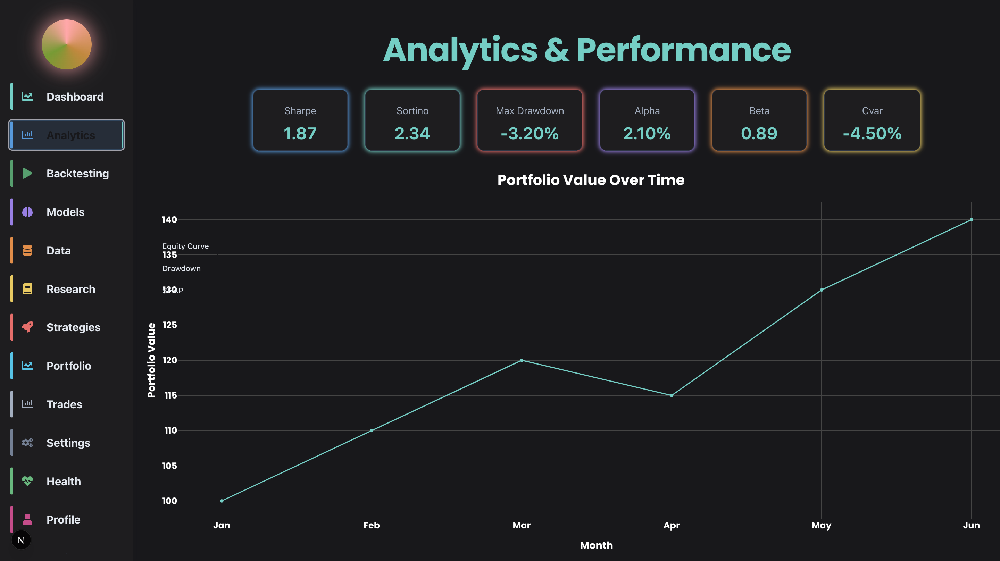
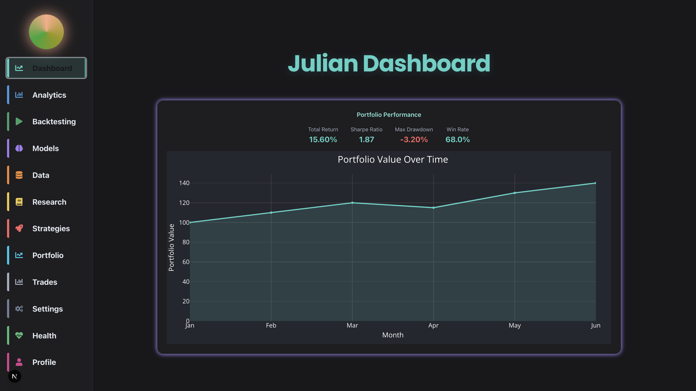
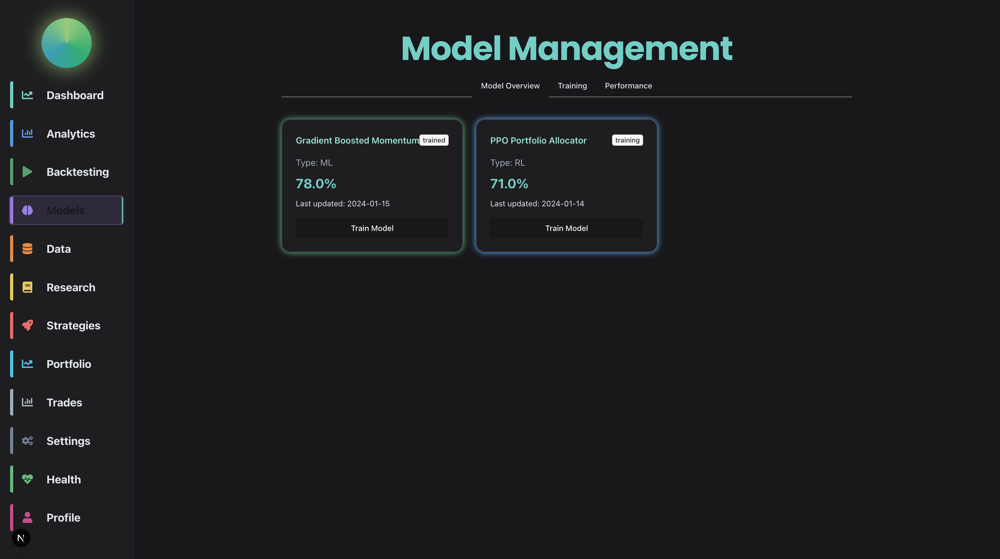

# Julian Quant Platform

## What is Julian?

Julian is a modern, modular quant research and trading platform. It's not just another analytics tool—it's my personal research lab, trading cockpit, and a canvas for building, testing, and visualizing real strategies. Every pixel and API call is here because I wanted it to be.

---

## Features

- **Sleek, professional dashboard** with persistent sidebar navigation
- **TradingView-style analytics**: beautiful, interactive charts and performance stats
- **Modular Python backend**: plug in your own models, features, and strategies
- **Backtesting engine**: run and visualize your strategies
- **Portfolio and trade management**: see your allocations, trades, and performance at a glance
- **Health monitoring**: API, database, and worker status at a glance
- **Dark mode, glassmorphism, and subtle glows** for a modern, readable UI

---

## Screenshots

Here's what I'm proud of (and what I stare at way too much):

### Dashboard


### Analytics & Performance


### Model Management


---

## Why I Built This

I wanted a quant platform that felt as good to use as the best trading dashboards out there—something I could be proud of, that reflects real effort and attention to detail. Every feature, every chart, every bit of glow was built with care. This is my playground, my research lab, and my trading cockpit.

---

## Getting Started

1. **Clone the repo**
   ```bash
   git clone https://github.com/yourusername/julian-quant-platform.git
   cd julian-quant-platform
   ```
2. **Install dependencies**
   - Python: `pip install -r requirements.txt` or use `poetry install`
   - Frontend: `cd web-frontend && npm install`
3. **Run the backend**
   ```bash
   uvicorn api_backend.main:app --reload
   ```
4. **Run the frontend**
   ```bash
   cd web-frontend && npm run dev
   ```
5. **Open your browser**
   Go to [http://localhost:3000](http://localhost:3000) and enjoy!

---

## Contributing

This is a personal project, but if you're a fellow quant or dev who cares about quality, feel free to open an issue or PR. Let's build something great together.

---

## License

MIT License

---

*Proudly built by a real human, not an AI. Every commit is a step closer to the quant platform I always wanted.*
