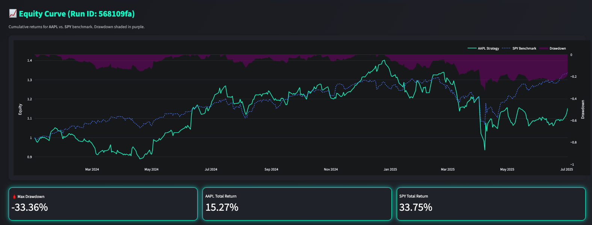

# 🧠 Julian Quant Platform

A next-generation, open quant research platform for portfolio analytics, ML explainability, and rapid strategy prototyping. Built for researchers, traders, and data scientists who want beautiful, interactive analytics with real market data.

---

## 🚀 Features

- **Real Market Data**: Fetches live prices from Yahoo Finance (yfinance)
- **Portfolio Analytics**: Optimal allocations (PyPortfolioOpt), drawdown, returns, and more
- **ML Explainability**: SHAP feature importances for real financial features
- **Interactive Dashboard**: Streamlit UI with dark/light/neon themes, glassmorphism, and live tickers
- **Modular Monorepo**: Clean, extensible Python/Poetry structure for analytics, models, and strategies
- **Production-Ready**: Docker, CI/CD, Sphinx docs, and robust error handling

---

## 🖼️ Screenshots

<p align="center">
  
</p>

<p align="center"><i>Interactive Equity Curve & Metrics Dashboard</i></p>

---

## ⚡ Quickstart

1. **Clone the repo**
   ```bash
   git clone https://github.com/yourusername/julian-quant-platform.git
   cd julian-quant-platform
   ```
2. **Install Poetry & dependencies**
   ```bash
   pip install poetry
   poetry install
   ```
3. **Run the dashboard**
   ```bash
   poetry run streamlit run dashboard/streamlit_app.py
   ```

---

## 🏄 Example Usage

- Select strategies, assets, and date range in the sidebar
- Click **Run Backtest** to fetch real data and compute analytics
- Explore:
  - 📈 **Equity Curve**: Interactive plot with drawdown and metrics
  - 📊 **Allocations**: Optimal portfolio weights (PyPortfolioOpt)
  - 🧬 **SHAP Explain**: ML feature importances for your asset

---

## 🛠️ Tech Stack

- **Python 3.11+**
- **Poetry** (dependency management)
- **Streamlit** (dashboard UI)
- **Plotly** (interactive plots)
- **PyPortfolioOpt** (portfolio optimization)
- **SHAP** (ML explainability)
- **yfinance** (real market data)
- **scikit-learn** (ML models)
- **Docker, CI/CD, Sphinx** (production-ready infra)

---

## 🤝 Contributing

Pull requests, issues, and feature ideas are welcome! See [CONTRIBUTING.md](CONTRIBUTING.md) for guidelines.

- [ ] Add more strategies and analytics
- [ ] Improve mobile/responsive UI
- [ ] Add user authentication and saved dashboards
- [ ] Integrate more data sources (crypto, fundamentals)

---

## 📜 License

MIT License. See [LICENSE](LICENSE) for details.

---

> _Julian Quant Platform — built to empower the next generation of quant researchers and traders._